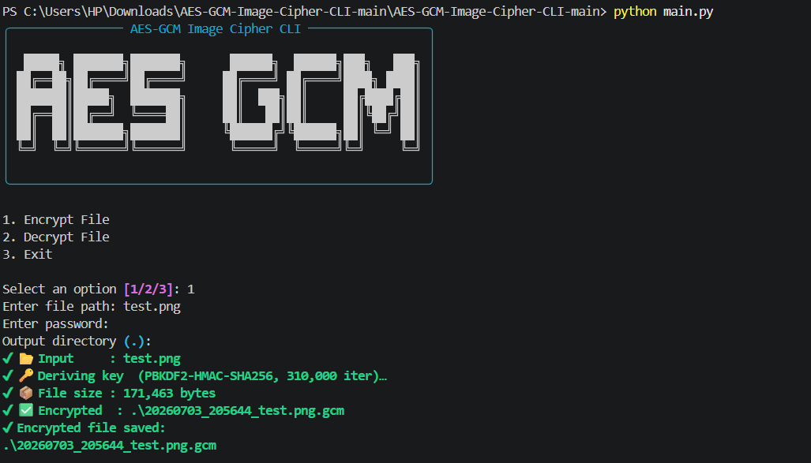
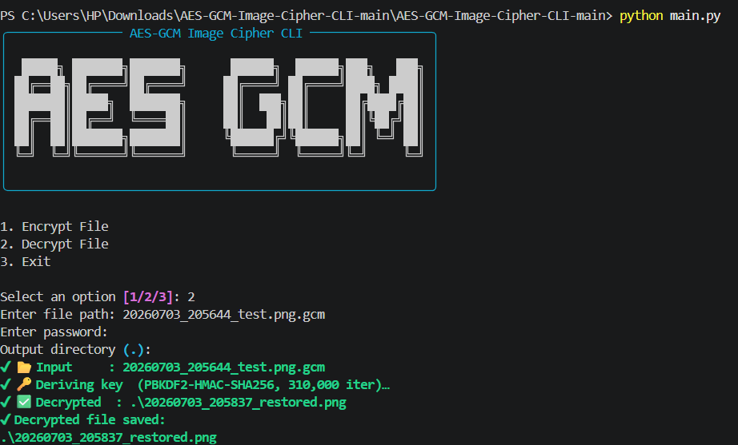
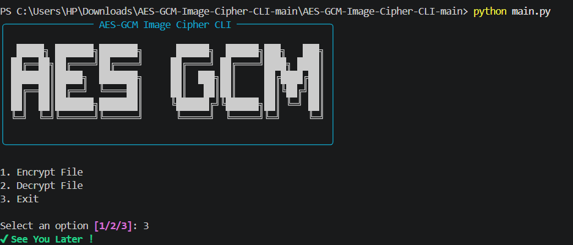

# 🔐 AES-GCM-Image-Cipher-CLI

### AES-256-GCM Image Encryption & Decryption Toolkit (CLI Edition)

**AES-GCM-Image-Cipher-CLI** is a secure, password-based **command-line application** built entirely in Python **(3.12.x compatible)** for encrypting and decrypting image files using **AES-256-GCM.**

Designed with a **security-first approach**, the project combines modern authenticated encryption with a clean, menu-driven interface while keeping the cryptographic implementation modular and reusable.

All encryption and decryption operations are performed **locally with no network communication**, ensuring complete privacy.

---

## ✨ Key Philosophy

This project is designed with three core principles:

1. **Security-first** – Modern authenticated encryption with AES-256-GCM
2. **Modular Design** – Cryptographic logic separated from CLI interface
3. **Simple User Experience** — Easy-to-use menu-driven terminal application

The cryptographic engine is completely independent of the CLI and can be reused in other Python projects.

---

## 🧩 Features

### 🔒 Encryption
- AES-256-GCM authenticated encryption
- PBKDF2-HMAC-SHA256 key derivation
- 310,000 PBKDF2 iterations
- Random 16-byte Salt
- Random 12-byte IV (Nonce)
- Original image extension preserved
- Timestamp-based output filenames
- Output extension: `.gcm`
- Detects accidental overwrite

### 🔓 Decryption
- Restores original image format automatically
- Verifies authentication tag before decryption
- Detects wrong passwords
- Detects corrupted or modified files
- Validates custom file header before processing

### 🎨 Rich CLI Interface
- Colored terminal output
- Structured key display tables
- Styled panels for encoding/decoding results
- Better user experience and readability

### ⚡ Dual Mode Support
- 🧼 Basic CLI → Lightweight, no dependencies
- 🎨 Rich CLI → Enhanced UI with colors and panels

---

## 📁 Project Structure

```bash
AES-GCM-Image-Cipher-CLI/
│
├── assets/
│
├── cli/
│   ├── __init__.py
│   ├── display.py
│   ├── interactive.py
│   └── commands.py
│
├── core/
│   ├── __init__.py
│   └── crypto.py
│
├── main.py
├── requirements.txt
├── README.md
└── LICENSE
```

> ✔ Cryptographic operations remain independent from the command-line interface, improving maintainability and code reuse.

---

## 🔐 Cryptography Details

| Component            | Implementation     |
| -------------------- | ------------------ |
| Encryption Algorithm | AES-256-GCM        |
| Key Derivation       | PBKDF2-HMAC-SHA256 |
| PBKDF2 Iterations    | 310,000            |
| Salt                 | 16 Bytes (Random)  |
| IV / Nonce           | 12 Bytes (Random)  |
| Authentication Tag   | 128-bit GCM Tag    |
| Rich                 | Interactive CLI interface |
| Output Extension     | `.gcm`             |


> Each encrypted file uses a unique Salt and IV, ensuring identical images encrypted with the same password produce different ciphertexts.

---

## 🖥️ CLI Modes

The application supports three different ways to use the encryption engine.

---

### 1️⃣ Interactive Menu

Launch the application without arguments.

```bash
python main.py
```

Example:

```text
==============================
 AES-GCM Image Cipher CLI
==============================

1. Encrypt Image
2. Decrypt Image
3. Exit
```

Perfect for users who prefer guided interaction.

---

### 2️⃣ Command Flags

#### Encrypt

```bash
python main.py -e -f image.png -p MyPassword
```

#### Decrypt

```bash
python main.py -d -f image.gcm -p MyPassword
```

#### Specify output directory

```bash
python main.py -e -f image.png -p MyPassword -o output
```

---

### 3️⃣ CLI Subcommands

#### Encrypt

```bash
python main.py encrypt -f image.png -p MyPassword
```

or

```bash
python main.py enc -f image.png -p MyPassword
```

#### Decrypt

```bash
python main.py decrypt -f image.gcm -p MyPassword
```

or

```bash
python main.py dec -f image.gcm -p MyPassword
```

---

## 🚀 Getting Started

### 1️⃣ Clone Repository

```bash
git clone https://github.com/ShakalBhau0001/AES-GCM-Image-Cipher-CLI.git
cd AES-GCM-Image-Cipher-CLI
```

### 2️⃣ Install Dependencies

```bash
pip install -r requirements.txt
```

### 3️⃣ Run Application

```bash
python main.py
```

---

## 📦 requirements.txt

```txt
cryptography
rich
pillow
```

> _No hidden or unnecessary dependencies._

---

## ⚙️ How It Works

**1️⃣ Key Derivation**
- Password → PBKDF2-HMAC-SHA256 (310,000 iterations) → 32-byte AES-256 key

**2️⃣ Encryption**
- Generates a random Salt
- Generates a random IV (Nonce)
- Derives the AES key from the password
- Encrypts the image using AES-256-GCM
- Preserves the original file extension
- Saves the encrypted file as `.gcm`
```
+--------------------------------------------------------------+
| MAGIC HEADER | SALT | IV | Extension | Ciphertext | GCM Tag |
+--------------------------------------------------------------+
```

**3️⃣ Decryption**
- Validates MAGIC header
- Extracts Salt, IV, and original extension
- Re-derives AES key using password + salt
- GCM tag verifies integrity before decryption
- Restores original file

---

## ⚠️ Common Errors

| Error             | Reason                                 |
| ----------------- | -------------------------------------- |
| Wrong Password    | Authentication tag verification failed |
| Invalid File      | MAGIC header not found                 |
| Corrupted File    | File contents have been modified       |
| Invalid Extension | Only `.gcm` files can be decrypted     |
| Empty Password    | Password cannot be empty               |

---

# 🛡️ Security Features

- AES-256 authenticated encryption
- Strong PBKDF2 key derivation
- Random Salt for every encryption
- Random IV (Nonce)
- Authentication Tag verification
- MAGIC header validation
- Original extension preservation
- No plaintext metadata leakage
- Local processing only
- Interactive menu-driven interface
- Full command-line interface (CLI)
- Short flags (`-e`, `-d`)
- Subcommands (`encrypt`, `decrypt`)
- Alias support (`enc`, `dec`)
- Timestamp-based output filenames
- Cross-module architecture

---


## 🛣️ Roadmap

- Folder encryption support
- Drag-and-drop interface (GUI version)
- Batch image encryption
- Standalone executable builds
- Cross-platform testing
- Performance optimizations

---

## ⚠️ Security Disclaimer

This project is intended for **educational, learning, and research purposes**.

Although it implements modern cryptographic standards, it has **not undergone an independent professional security audit**.

Avoid relying on this software for protecting highly sensitive or mission-critical data.

---

## 📸 Preview

### 1. **Encryption**



### 2. **Decryption**



### 3. **Exit**



---

## 🪪 Author

> **Developer:** **Shakal Bhau**

> **GitHub:** **[ShakalBhau0001](https://github.com/ShakalBhau0001)**

---

> "Strong encryption should protect users without making security difficult to use."

---

## ⭐ Support

If you like this project, consider giving it a ⭐ on GitHub!

---
